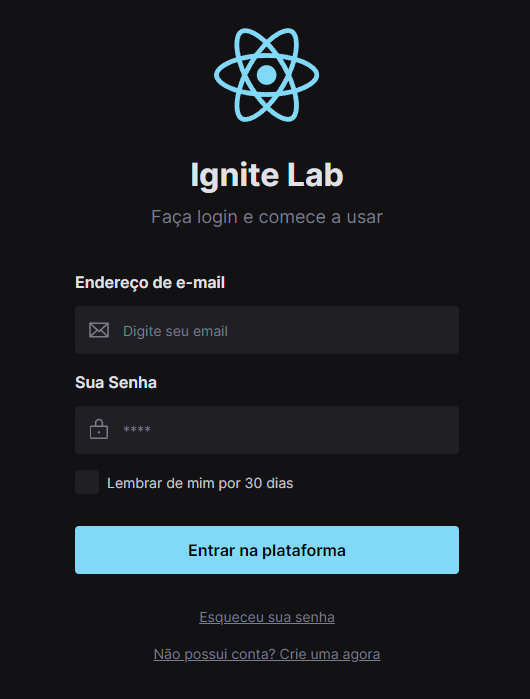

<h1 align="center"> Ignite Lab #01 </h1>

Evento exclusivo e gratuito, promovido pela Rocketseat para ensino de tecnologias WEB.

  <a href="#-tecnologias">Tecnologias</a>&nbsp;&nbsp;&nbsp;|&nbsp;&nbsp;&nbsp;
  <a href="#-projeto">Projeto</a>&nbsp;&nbsp;&nbsp;|&nbsp;&nbsp;&nbsp;
  <a href="#-layout">Layout</a>&nbsp;&nbsp;&nbsp;|&nbsp;&nbsp;&nbsp;
  <a href="#memo-licença">Licença</a>

  

 

  

## 🚀 Tecnologias

Esse projeto foi desenvolvido com as seguintes tecnologias:

- HTML
- ReactJS
- Typescript
- [TailwindCSS](https://tailwindcss.com/)
- [Vite](https://vitejs.dev/)
- [Radix](https://radix-ui.com)
- [Storybook](https://storybook.js.org/)

## 💻 Projeto

Um sistema de login não funcional, onde o maior objetivo era aprender mais sobre o [Storybook](https://felipe-hvsilva.github.io/ignite-lab-design-system/?path=/story/components-button--default)

## 🔖 Layout

Você pode visualizar o layout do projeto através [DESSE LINK](https://www.figma.com/file/81QyAxNXlsqYzziM6fxNX1/Ignite-Lab-Design-System?node-id=0%3A1). É necessário ter conta no [Figma](https://figma.com) para acessá-lo.

## :memo: Licença

Esse projeto está sob a licença MIT.

---
